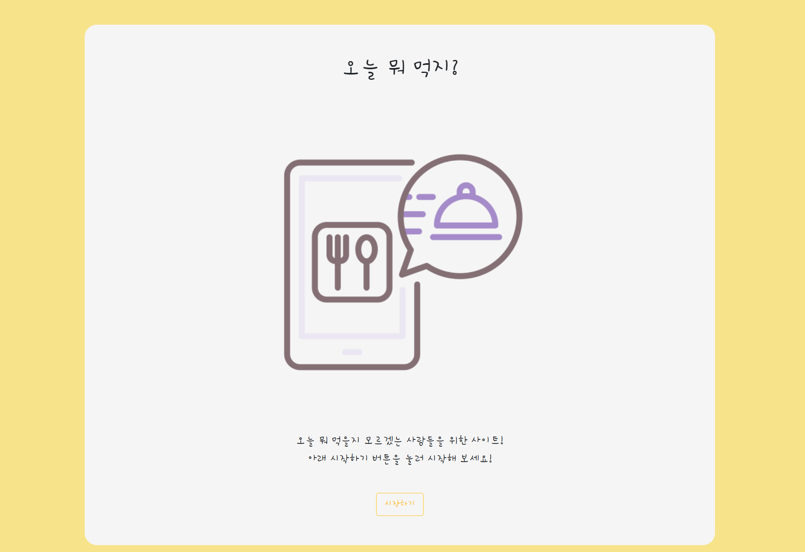
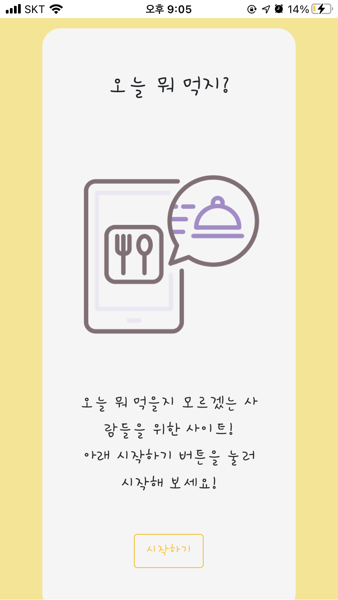
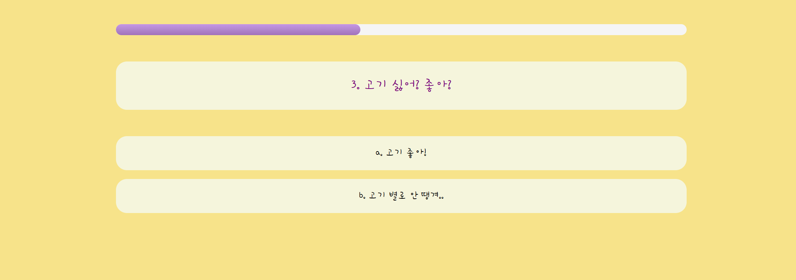
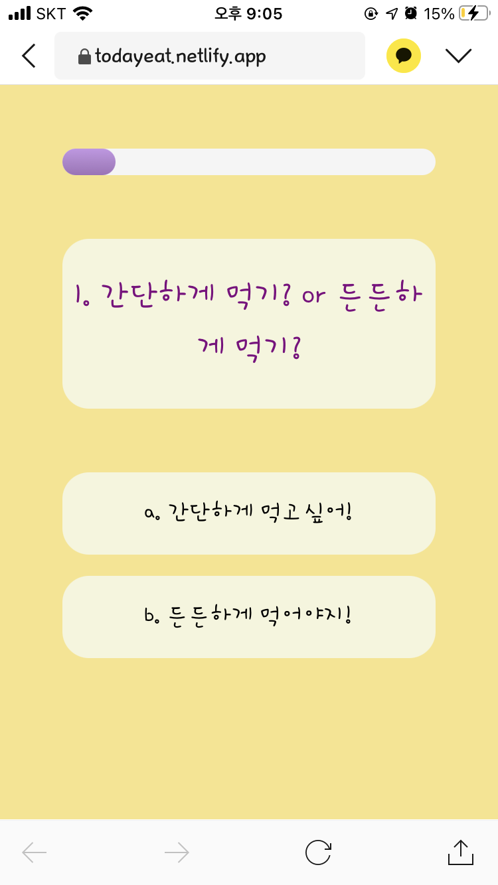
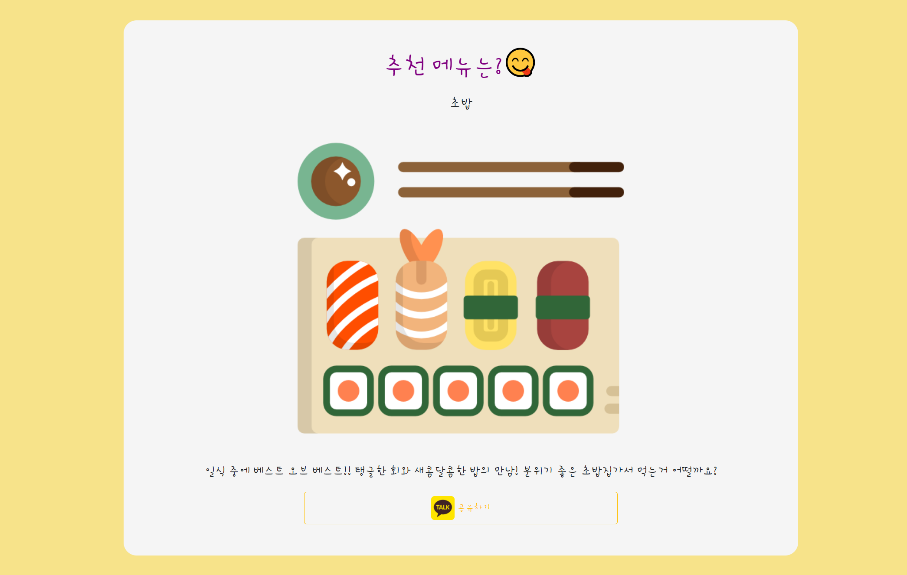
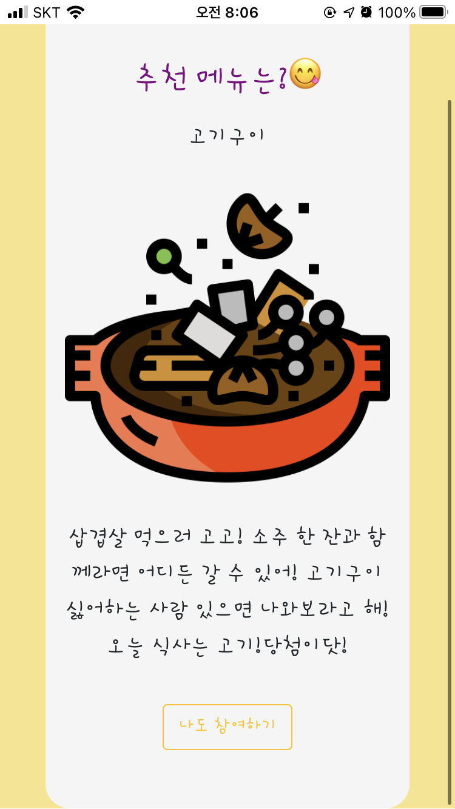
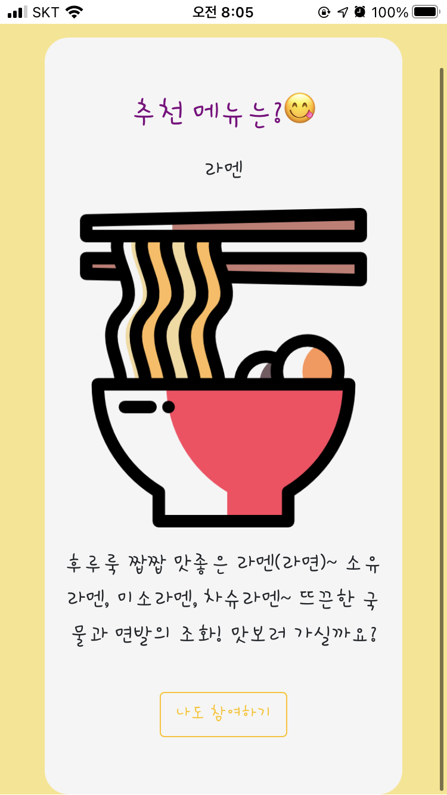
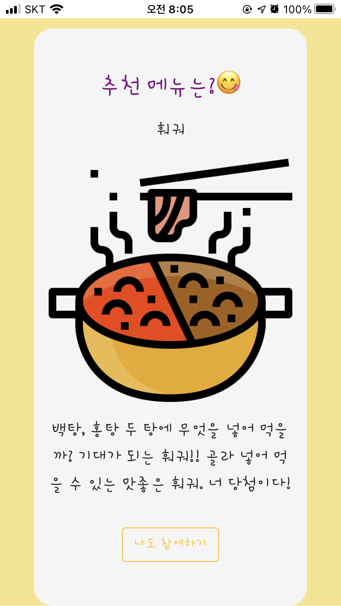
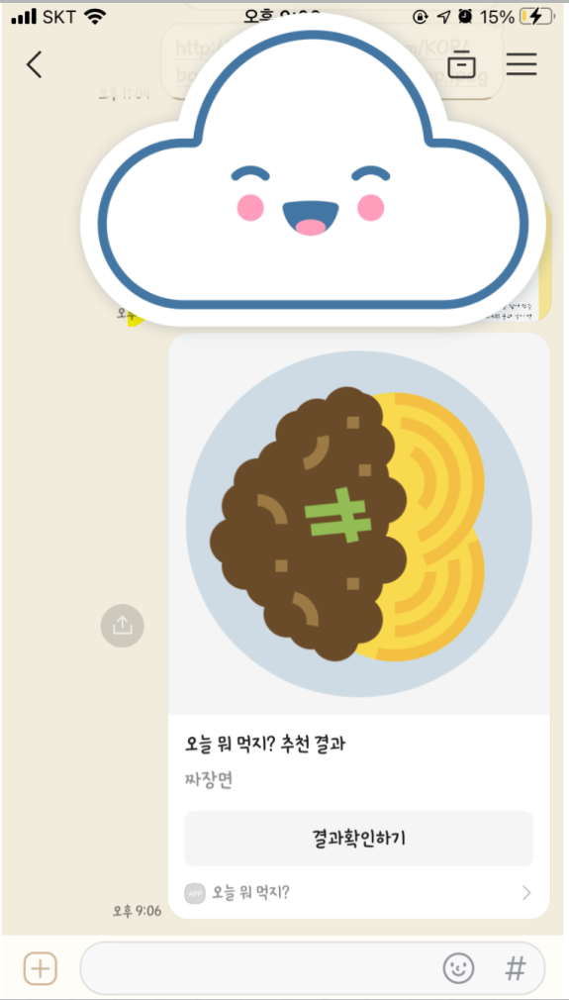

# '오늘 뭐 먹지?' ToyProject

https://todayeat.netlify.app/

Netlify로 배포한 토이프로젝트

html, css, javascript 사용

## 기능

1. 선택지에 대한 답을 기반으로 음식 추천 알고리즘
2. 선택지 상태바 (채워져서 얼만큼 진행되었는지) 
3. 카카오톡으로 결과 공유
   * 총 결과 15가지 음식
4. 반응형 웹

## 구현화면

* 메인화면

  * 웹

    

  * 모바일

    

* 선택지 선택

  * 웹

    

  * 모바일

    

* 결과

  * 웹

    

  * 모바일

    
    
    
    
    
  
* 카카오톡 결과 공유 

  

